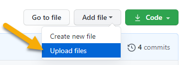
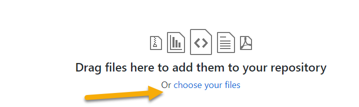
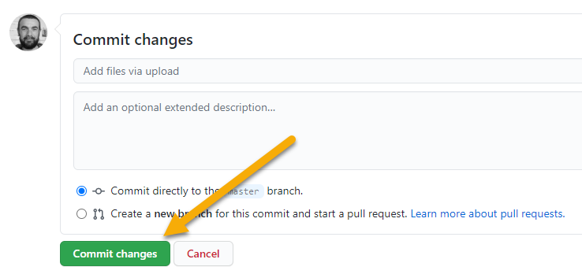

# Parish Council meeting minutes

This is where you upload meeting minutes. 

Each time you upload a file it will trigger an update of the Parish Council website. 

It will take a minute or two for the update, then you will see the new file in the minutes list:

> https://haresfield-pc.org/minutes/

## How to upload a new file

1. Click the _Add file_ button at the top of this page, then click _Upload files_:

2. Drag the file into the window from your file explorer, or click _choose your files_ to select the file from your computer:

3. Click the _Commit changes_ button at the bottom of the page:

## File details

You can call the file anything you want, but if it follows a pattern then the website links will be nicer:

* include the four-digit year (e.g. 2020)
* include a three-letter abbreviated month name (e.g. Jun)

Example: _Sep 2020 Minutes.docx_ will show on the site as _September 2020_.

Currently the system expects Word documents, but it can easily be changed to accept PDFs and other file types.

